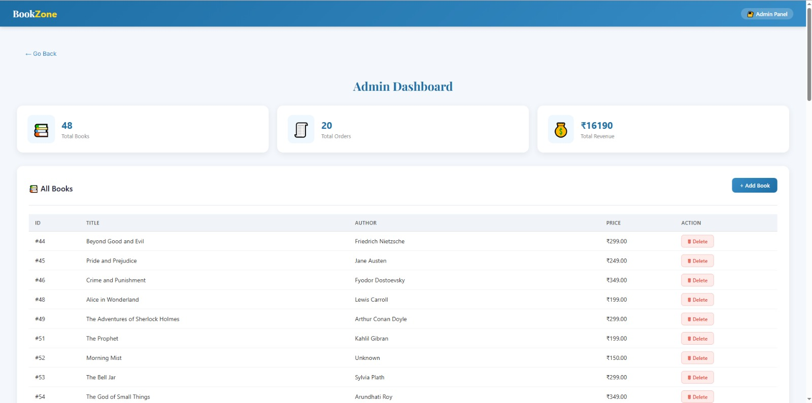
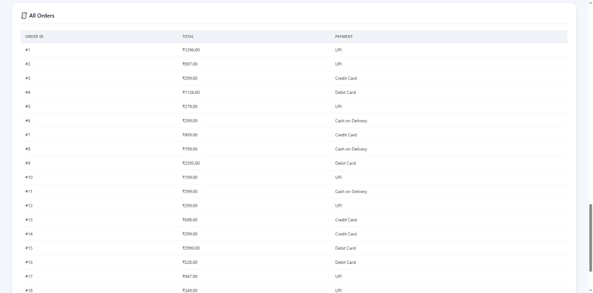
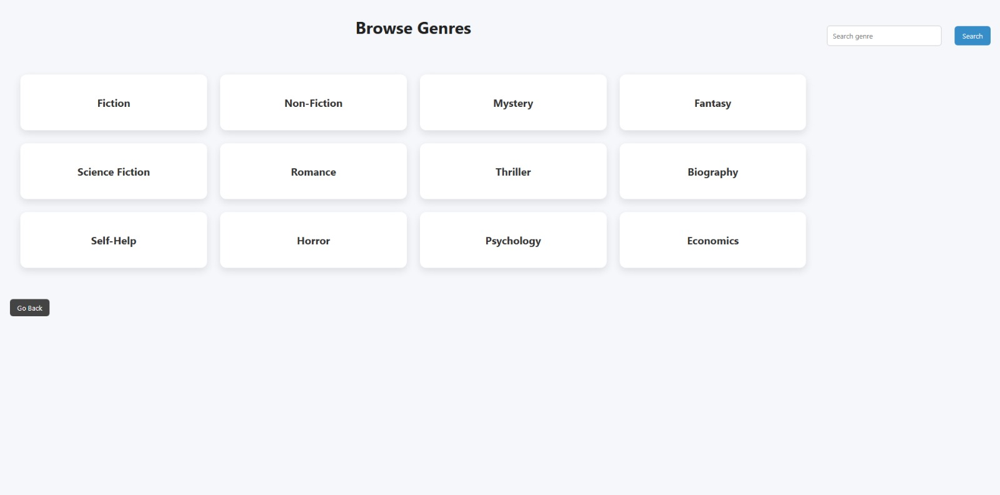
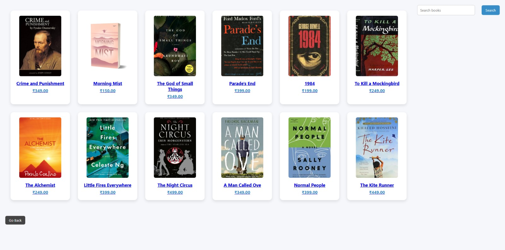
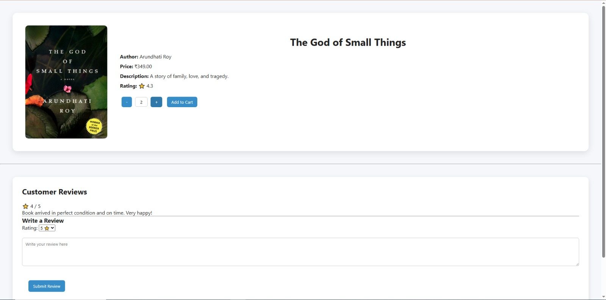
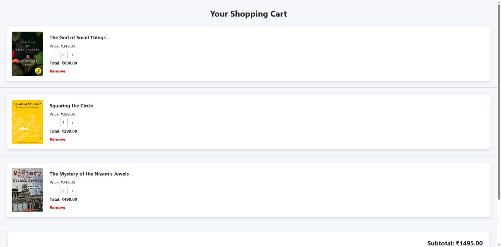
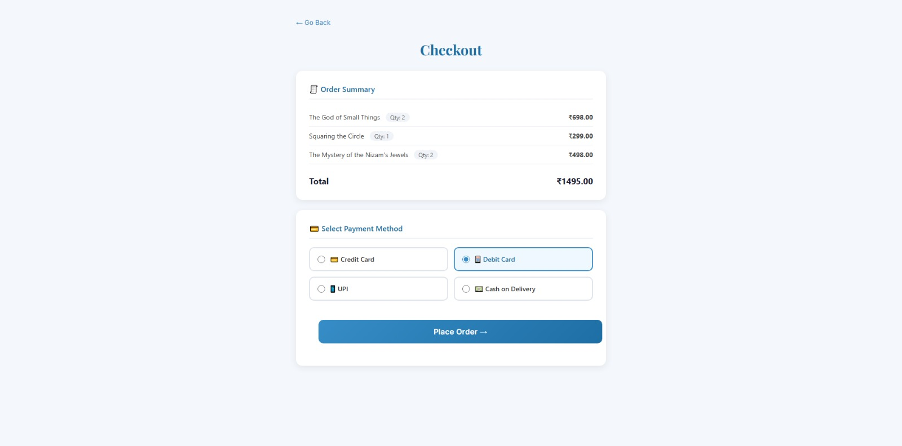
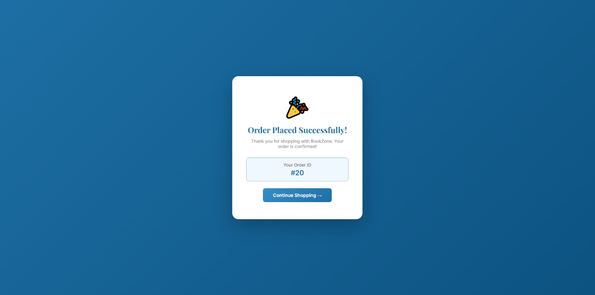

<h1 align="center">📚 Bookstore Management System</h1>

<p align="center">
A full-stack bookstore management system built with Flask and PostgreSQL.
</p>


---

<p align="center">
  
</p>

## ✨ Features

- 🔐 User Login
- 🏠 Home Page
- 📖 Browse Books
- 📚 Book Information Page
- 🗂️ Browse by Genre
- 🛒 Shopping Cart
- 💳 Checkout System
- ✅ Order Success Confirmation
- 🛠️ Admin Dashboard for managing the bookstore

---

## 🛠️ Tech Stack

- Python
- Flask
- HTML5
- CSS3
- PostgreSQL

---

## 📂 Project Structure

```text
Bookstore-Management-System/
│
├── static/
├── templates/
├── screenshots/
├── app.py
├── database.py
├── schema.sql
├── requirements.txt
└── README.md
```

---

## 🚀 Installation

### 1. Clone the repository

```bash
git clone https://github.com/Saracode06/Bookstore-Management-System.git
```

### 2. Move into the project folder

```bash
cd Bookstore-Management-System
```

### 3. Install dependencies

```bash
pip install -r requirements.txt
```

### 4. Configure PostgreSQL

Create a PostgreSQL database and update your database credentials in the project configuration.

### 5. Run the application

```bash
python app.py
```

---

# 📸 Screenshots

## Home Page


---

## Login Page


---

## Admin Dashboard (Book Management)



---

## Admin Dashboard (View Orders)



---

## Browse by Genre



--

## Browse Books



---

## Book Details




---

## Shopping Cart



---

## Checkout



---

## Order Successful



---

## 👨‍💻 Author

**Sara Sayyed**

GitHub: https://github.com/Saracode06

## ⭐ If you like this project

Please consider giving it a star!
